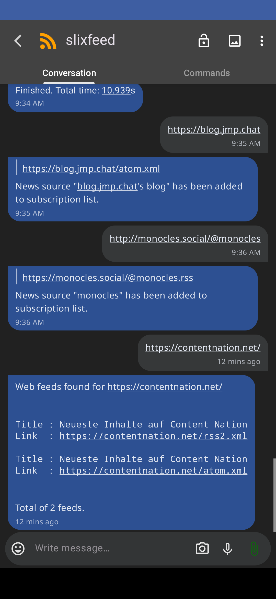
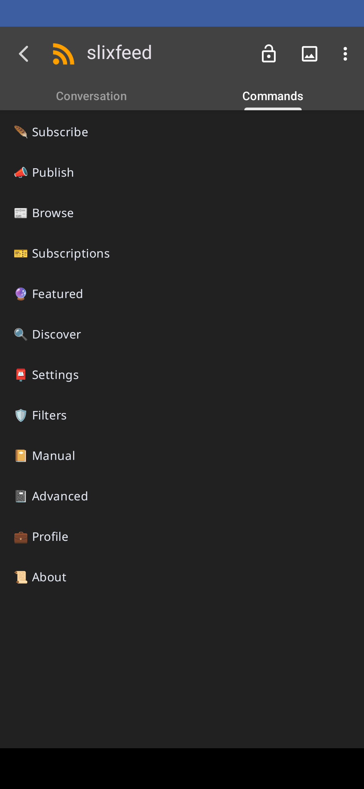
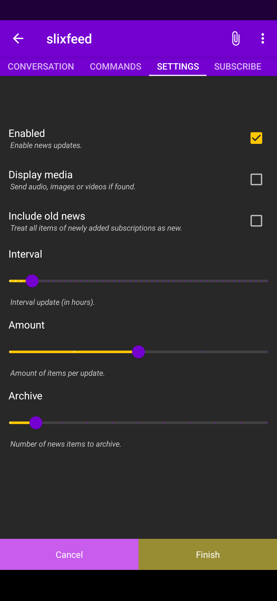

# Work in Progress

This bot is still a work in progress. Albeit this bot works well in most cases, it is not yet ready for production. We are working to make this bot better.

---

# Syndication bot for XMPP

## Slixfeed

Slixfeed is a news aggregator bot for the XMPP communication network which aims to be easy to use and fully-featured. It provides a convenient access to Blog and News sites.

## XMPP

XMPP is the Extensible Messaging and Presence Protocol, a set of open technologies for instant messaging, presence, multi-party chat, voice and video calls, collaboration, lightweight middleware, content syndication, and generalized routing of XML data.

Visit [XMPP](https://xmpp.org/) for more information [about](https://xmpp.org/about/) the XMPP protocol and check the [list](https://xmpp.org/software/) of XMPP clients.

Slixfeed is primarily designed for XMPP (aka Jabber), yet it is built to be extended to other protocols.

## Features

- **Ease** - Slixfeed automatically scans (i.e. crawls) for syndication feeds of given URL.
- **Encryption** - Messages are encrypted with the OMEMO standard.
- **Export** - Download articles as ePUB, HTML, Markdown and PDF.
- **Filtering** - Filter news items using lists of allow and deny.
- **Multimedia** - Display audios pictures and videos inline.
- **Privacy** - Redirect to alternative back-ends, such as Invidious, Librarian, Nitter, for increased privacy, productivity and security.
- **Portable** - Export and import feeds with a standard OPML file.
- **Simultaneous** - Slixfeed is designed to handle multiple contacts, including groupchats, Simultaneously.
- **Visual interface** - Interactive interface for XMPP using Ad-Hoc Commands,

## Preview

### monocles chat




<!--   -->

### Cheogram




<!--    -->

## Getting Started

### Install

It is possible to install Slixfeed using pip and pipx.

#### pip inside venv

```
$ python3 -m venv .venv
$ source .venv/bin/activate
$ pip install git+https://git.xmpp-it.net/sch/Slixfeed
```

#### pipx

##### Install

```
$ pipx install git+https://git.xmpp-it.net/sch/Slixfeed
```

##### Update

```
$ pipx uninstall slixfeed
$ pipx install git+https://git.xmpp-it.net/sch/Slixfeed
```

### Start

```
$ slixfeed
```

### Usage

- Add the bot to contact list and follow it instructions.
- Send command `help` or `commands` for a list of commands.

## Recommended Clients

Slixfeed works with any XMPP chat client; if you want to make use of the visual interface Slixfeed has to offer (i.e. Ad-Hoc Commands), then you are advised to use [Cheogram](https://cheogram.com), [Converse](https://conversejs.org), [Gajim](https://gajim.org), [LeechCraft](https://leechcraft.org/plugins-azoth-xoox), [monocles chat](https://monocles.chat), [Movim](https://mov.im), [Poezio](https://poez.io), [Psi](https://psi-im.org) or [Psi+](https://psi-plus.com).

### Support

Please join our support groupchats whether you want help, discuss new features or just greet us.

- [Main Groupchat](xmpp:slixfeed@chat.woodpeckersnest.space?join) (International)
- [Deutsche Chat Gruppe](xmpp:slixfeed@conference.miharu.dedyn.io?join) (German)

## Authors

- [Schimon](xmpp:sch@pimux.de?message) (Author).
- [Laura](xmpp:lauranna@404.city?message) (Co-Author, Instructor and Mentor).

## Contributors

- Mr. [Stephen Paul Weber](https://singpolyma.net/) from [Sopranica](https://soprani.ca/) who has provided code for Data Forms to be used as visual interface for Ad-Hoc Commands, and who has taught me about Data Forms.

## Thanks

- Mr. Guus der Kinderen from [Ignite Realtime](https://igniterealtime.org/) who has provided [Openfire](https://igniterealtime.org/projects/openfire/) servers at [GoodBytes](http://goodbytes.nl/)
- Mr. [Simone "roughnecks" Canaletti](https://woodpeckersnest.space/) who has provided a [Movim](https://join.movim.eu/) instance.

## Acknowledgment

Special thank you to Mrs. Lapina who instructed me during months to complete this, in addition to significant code fixes.

Laura, I thank you greatly for your encouragement, time and help. This software would not have existed without you.

May this software be a life changing factor to people the world over.

## License

MIT license.

## Copyright

- Schimon Zackary 2022 - 2024
- Laura Lapina 2022 - 2023

## Similar Projects

Please visit our friends who offer different approach to convey syndication feeds to XMPP.

* [AtomToPubsub](https://github.com/imattau/atomtopubsub)
Syndication feeds as XMPP Pubsub Nodes.

* [err-rssreader](https://github.com/errbotters/err-rssreader)
A port of old Brutal's RSS Reader for Errbot.

* [feed-to-muc](https://salsa.debian.org/mdosch/feed-to-muc)
An XMPP bot which posts to a MUC (groupchat) if there is an update in newsfeeds.

* [Jabber RSS Transport](https://jabberworld.info/Jabber_RSS_Transport)
Syndication feeds as contacts.

* [JabRSS](https://dev.cmeerw.org/Projects/jabrss) by Christof
A simple syndication headline notification service for Jabber/XMPP.

* [JabRSS](http://www.jotwewe.de/de/xmpp/jabrss/jabrss_en.htm) by Jens W. Wulf
Never miss a headline again! JabRSS is a simple syndication headline notification service for Jabber.

* [Morbot](https://codeberg.org/TheCoffeMaker/Morbot)
Morbo is a simple Slixmpp bot that will take new articles from listed syndication feeds and send them to assigned XMPP MUCs (groupchats).

* [XMPP Bot](https://github.com/nioc/xmpp-bot)
An XMPP bot for making the link between XMPP conversations and webhooks.
